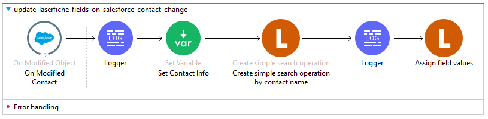

= Laserfiche Connector User Manual

== Introduction

Leverage the Laserfiche Connector to build integrations with other enterprise platforms and implement custom end-to-end solutions. Currently, the Laserfiche Connector supports operations that allow you to interact with your Laserfiche repository. The Laserfiche Connector promotes easy access to information inside and outside your business, all while maintaining content compliance at all stages, from initial capture to final archival.

== Prerequisites

This document assumes that you are familiar with:

* Mule 4
* https://www.mulesoft.com/platform/cloud-connectors[Anypoint Connectors [mulesoft.com\]]
* https://docs.mulesoft.com/studio/7.7/[Anypoint Studio [docs.mulesoft.com\]]. To increase your familiarity with Studio, consider completing an https://docs.mulesoft.com/studio/7.7/[Anypoint Studio [docs.mulesoft.com\]] Tutorial.

This page requires some basic knowledge of:

* https://docs.mulesoft.com/mule-runtime/latest/[Mule Concepts [docs.mulesoft.com\]]
* https://docs.mulesoft.com/mule-runtime/latest/mule-components[Components in a Mule Flow [docs.mulesoft.com\]]
* https://docs.mulesoft.com/mule-runtime/4.4/global-elements[Global Elements [docs.mulesoft.com\]].

Before creating an app, you must have:

* A Laserfiche repository. https://www.laserfiche.com/products/document-management/[Learn more.]
* For Laserfiche Cloud, a service application configured to use the Laserfiche Connector. See <<Resources>> for how to configure a service application.

== Hardware and Software Requirements

For hardware and software requirements, please visit the Hardware and https://docs.mulesoft.com/mule-runtime/4.2/hardware-and-software-requirements[Software Requirements page [docs.mulesoft.com\]].

=== Compatibility

[%header%autowidth]
|===
|Application/Service |Version
|Mule Runtime	     |  4.4
|Laserfiche API |  V1 and build version 3a7a49ffc2db49aecc10091994a0292be398cd51_.20221214.3
|Java	             |  1.8 and later
|===

=== Laserfiche API Compatibility
Laserfiche Connector supports all of the actions included in Laserfiche API v1.

== Installing the Laserfiche Connector

* You can install the Laserfiche Connector in Anypoint Studio using the instructions in https://docs.mulesoft.com/exchange/#installing-a-connector-from-anypoint-exchange[Installing a Connector from Anypoint Exchange. [docs.mulesoft.com\]]

== Maven Dependency Information

After downloading and installing the Laserfiche Connector, you need to make the Laserfiche Connector available for use inside a Mule application and also make it available to package the application with Laserfiche Connector. If you are using Anypoint Studio, it will do this automatically. For Maven dependency management, include the following XML snippet in the pom.xml file in the Mule project.

    <dependency>
        <groupId>com.mulesoft.connectors</groupId>
        <artifactId>mule4-laserfiche-connector</artifactId>
        <version>1.0.0</version>
        <classifier>mule-plugin</classifier>
    </dependency>

== Configuring the Laserfiche Connector

1. After adding the Laserfiche Connector dependency to Mule project, click the *Global Elements* tab at the base of the canvas.
2. From the Global Mule Configuration Elements screen, click *Create*. <>
3. From the Choose Global Type wizard, expand *Connector Configuration* and select *'Laserfiche Config'* and click OK. <>
4. From the *General* tab of the Laserfiche Connector, select *Laserfiche Cloud* or *Self-hosted connection* and enter the following properties:

.Laserfiche Config in Global Configuration Elements
[#img-global-laserfiche]
[caption="Figure 1: "]
image::img/global_laserfiche.png[]

.Laserfiche Config
[#img-global-laserfiche-config]
[caption="Figure 2: "]

Configuring the Laserfiche Connector for Laserfiche Cloud
[%header%autowidth.spread]
|===
|Field Name |Type |Value
|Service Principle Key |String |Create the Service Principal Key by creating a MuleSoft-specific Service Principal user in your Laserfiche Account Administration. Grant this user the appropriate access rights in Laserfiche to act on behalf of the Laserfiche Connector. Then open the user you created and click *Create Service Principal Keys*. Ensure you save this key as you will not be able to view this key again in Laserfiche. <>
|Base-64 Encoded Access Key |String |To create the Base-64 Encoded Access Key, in the Laserfiche Developer Console, create a MuleSoft app by creating a service application and selecting the Service Principal user as the Service Account. In the MuleSoft app you created, navigate to the Authentication tab, and click *Create key* next to Access Keys. Then download the key as a base-64 string and copy the key from there. <> <>
|===

.Service Principle Key
[#img-client-secret]
[caption="Figure 3: "]

.Access Key
[#img-service-key]
[caption="Figure 4: "]

.Access Key as Base-64 String
[#img-access-key]
[caption="Figure 5: "]
image::img/access_key.PNG[]

Configuring the Laserfiche Connector for Self-Hosted Connections
[%header%autowidth.spread]
|===
|Field Name |Type |Value
|Base URL |String |The base URL for your Laserfiche API. E.g., https://ServerName/LFRepositoryAPI
|Repository ID |String |The name of your Laserfiche repository.
|Username |String |The username of an account that has the appropriate access rights to the Laserfiche repository to make changes on behalf of MuleSoft.
|Password |String |The password for the above account.
|===

== Connector Namespace and Schema

When you are designing your application in Anypoint Studio and you drag the Laserfiche Connector from the palette onto the Anypoint Studio canvas, Anypoint Studio automatically populates the XML code with the connector *namespace* and *schema location*.

*Namespace:* `+http://www.mulesoft.org/schema/mule/connector+` +
*Schema Location:* `+http://www.mulesoft.org/schema/mule/connector/current/mule-connector.xsd+`

[TIP]
If you are manually coding the Mule application in Anypoint Studio's XML editor or another text editor, define the namespace and schema location in the header of your *Configuration XML*, inside the `<mule>` tag.

----
<mule xmlns:laserfiche="http://www.mulesoft.org/schema/mule/laserfiche"
      xmlns="http://www.mulesoft.org/schema/mule/core"
      xmlns:doc="http://www.mulesoft.org/schema/mule/documentation"
      xmlns:xsi="http://www.w3.org/2001/XMLSchema-instance"
      xsi:schemaLocation="http://www.mulesoft.org/schema/mule/core
      http://www.mulesoft.org/schema/mule/core/current/mule.xsd
      http://www.mulesoft.org/schema/mule/laserfiche
      http://www.mulesoft.org/schema/mule/laserfiche/current/mule-laserfiche.xsd">

      <!-- put your global configuration elements and flows here -->

</mule>
----

== Use Cases

The Laserfiche Connector serves as an integration point between Laserfiche and any other applications available on the MuleSoft platform. Use cases include:

* *Data Retrieval* - Retrieve documents or document metadata from Laserfiche and view or download in another system, like a CRM, ERP, or any system with relevant documents stored within Laserfiche. Examples: Salesforce, Dynamics, Oracle, NetSuite, SAP, JD Edwards, and Workday.

** *Sync metadata from Laserfiche to Dynamics* <>
*** *Listener* - Listens for HTTP or HTTPS requests.
*** *Set Variable* - Set a flow variable (e.g., account name from request body).
*** *Create Simple Search Operation* - Use a Laserfiche Connector operation to search for an entry and its field values (e.g., account city) by request input (e.g., account name from request body).
*** *Set Variable* - Set a flow variable using the field values from a searched for entry.
*** *Retrieve Multiple by Query* - Use Dynamics Connector operation to search accounts by name.
*** *Update* - Use Laserfiche field values (e.g., account city) to update your Dynamics account via the Dynamics Connector operation.

.Sync metadata from Laserfiche to Dynamics
[#img-use-case-1]
[caption="Figure 6: "]

* *Save and Automate Processes* - Save a document to Laserfiche or update Laserfiche metadata from another system. This action can be monitored to start a Laserfiche business process. Examples: Salesforce, Dynamics, Oracle, NetSuite, SAP, JD Edwards, and Workday.

** *Update Laserfiche metadata fields when a Salesforce contact is changed* <>
*** *On Modified Object* - Use Salesforce Connector source to listen for contact changes.
*** *Logger* - Log the start trace of the flow.
*** *Set Variable* - Set flow variable using the modified Salesforce contact info.
*** *Create Simple Search Operation* - Use a Laserfiche Connector operation to search for a Laserfiche entry with a name that matches the contact's name.
*** *Logger* - Log the search result.
*** *Assign Field Values* - Use a Laserfiche Connector operation to synchronize Laserfiche metadata fields and Salesforce contact fields.

** *Create a Laserfiche folder when a new contact is added to Salesforce* <>
*** *On New Object* - Use Salesforce Connector source to listen for a new contact to be created.
*** *Logger* - Log the start trace of the flow.
*** *Set Variable* - Set a flow variable using the newly created Salesforce contact info.
*** *Create or Copy Entry* - Use Laserfiche Connector operation to create a folder in Laserfiche with a name that matches the contact's name.
*** *Write template value to entry* - Use a Laserfiche Connector operation to assign a template to the newly created entry and populate its fields with the Salesforce contact's field values.

.Update a Laserfiche entry's fields when a Salesforce contact is modified
[#img-use-case-2a]
[caption="Figure 7: "]

.Create a Laserfiche folder for a new Salesforce contact
[#img-use-case-2b]
[caption="Figure 8: "]

* *Healthcare Data Gathering* - Convert Laserfiche document's metadata into the HL7 data format before sending it to a healthcare system requiring that standard. Example: HL7 Connector and HL7 MLLP Connector
* *AP Processing* - Laserfiche’s solutions for automating invoice processing can update necessary ERP and financial systems. Examples: Dynamics, Dynamics GP, Oracle ERP Cloud, Oracle E-Business Suite, and SAP

== Laserfiche Connector Specific Errors
* *INVALID_REQUEST* - 400 API error response
* *ACCESS_DENIED* - 403 API error response
* *ITEM_NOT_FOUND* - 404 API error response
* *CONFLICT_OR_PARTIAL_SUCCESS* - 409 API error response
* *LOCKED* - 423 API error response
* *RATE_LIMIT_REACHED* - 429 API error response
* *OTHER* - All other errors

== Resources
Check out the https://developer.laserfiche.com/index.html[Laserfiche API documentation] to see the https://developer.laserfiche.com/guide_oauth-service.html[service application configuration] (which is a prerequisite for Laserfiche Connector) and to view https://api.laserfiche.com/repository/swagger/index.html[all supported operations].